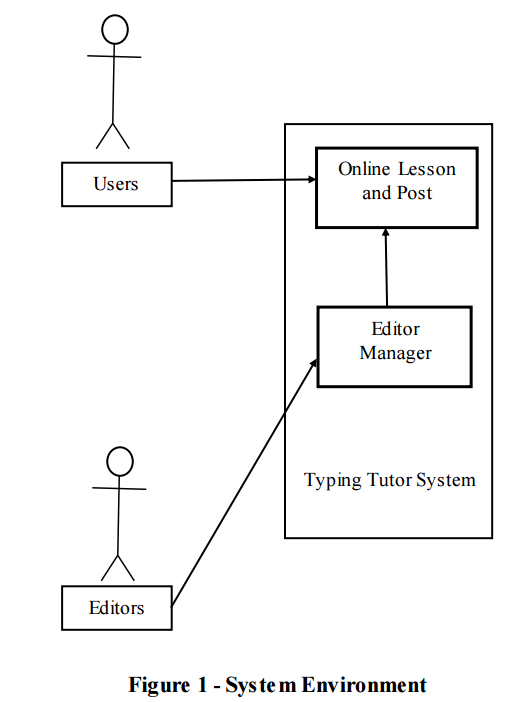
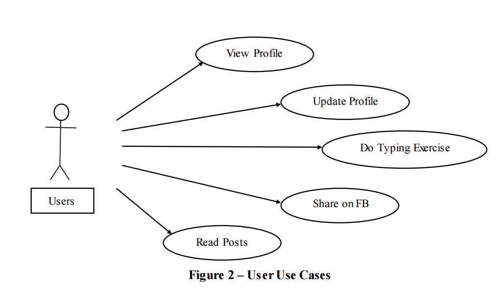
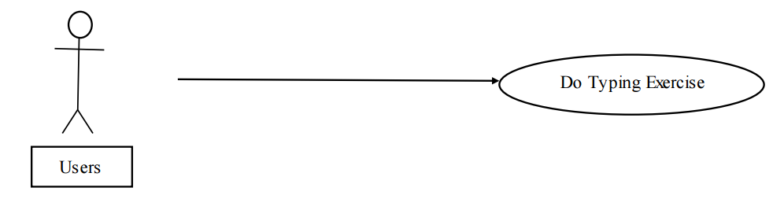

# Software Requirements for Typing Tutor
## Introduction
### Purpose
The purpose of this document is to present a detailed description of the Typing Tutor Website System. It will explain the purpose and features of the system, the interfaces of the system, what the system will do, the constraints under which it must operate and how the system will react to external stimuli. This document is intended for both the stakeholders and the developers of the system.

### Scope of the project
This software system will be a Typing Tutor Website for the beginners who want to learn 10 thumbs. This system will be designed to maximize the user’s typing speed by providing lessons to help them in learning and practicing typing 10 thumb efficiently and properly. By maximizing the user’s typing speed, users can improve the efficiency and productivity of using and utilizing the computer in their works as well as entertainment. 
More specifically, this system is designed to help the users learn from the first step of typing 10 thumbs through the basic lessons. In turn, they can practice typing from easy levels to advanced levels by applying some rules and tips we provide. The software will facilitate not only users, but also the editors who can easily create and post new post on website. 

### Glossary
|Term|Definition|
|---|---|
|Basic Lesson|The basic lesson provided for users to practice|
|Advanced Lesson|The high-level lesson for users to practice|
|User|An account registering on website|
|Database|Collection of all the information monitored by this system|
|Editor|Person who create and post lessons on the website|
|Software Requirements Specification|A document that completely describes all of the functions of a proposed system and the constraints under which it must operate. For example, this document|
|Stakeholder|Any person with an interest in the project who is not a developer|

### References
IEEE. **_IEEE Std 830-1998 IEEE Recommended Practice for Software Requirements Specifications_**. IEEE Computer Society, 1998. 

### Overview of Document
The next chapter, the Overall Description section, of this document gives an overview of the functionality of the product. It describes the informal requirements and is used to establish a context for the technical requirements specification in the next chapter. 

The third chapter, Requirements Specification section, of this document is written primarily for the developers and describes in technical terms the details of the functionality of the product.  

Both sections of the document describe the same software product in its entirety, but are intended for different audiences and thus use different language.

## Overall Description
### System Environment

The Web Typing Tutor System has two active actors including The User and The Editor. The User and Editor access the system through the Internet and login directly through the account registered using social network authentication.

### Functional Requirements Specification

This section outlines the use cases for each of the active users separately. The editor has only two use cases while the user is main actor in this system with 4 use cases.
#### User Use Case

##### Use Case: Do Typing Excersise
**Diagram**:

**Brief Description**

The User does a typing excersise

**Initial Step-by-Step Description**

Before this use case can be initiated, the User has already selected a typing lesson or a paragraph.

1. The system presents a dialog that tells the user to begin typing.
2. The User press Enter or click the OK button on the dialog.
3. The system presents the content of the typing test in a text box, along with the keyboard guide and the user’s current statistics. The first character of the text is highlighted.
4. The corresponding key in the keyboard is highlighted. If the user types the correct character, the next character is selected. Otherwise, the current character will be highlighted differently to reflect the error. This is repeated until there are no more characters.
5. The system displays a dialog informing the user that he/she has completed the exercise.
6. The user chooses to go back, practise again or share the progress on Facebook

**Xref**: Section 3.1.1, Do Typing Exercise
